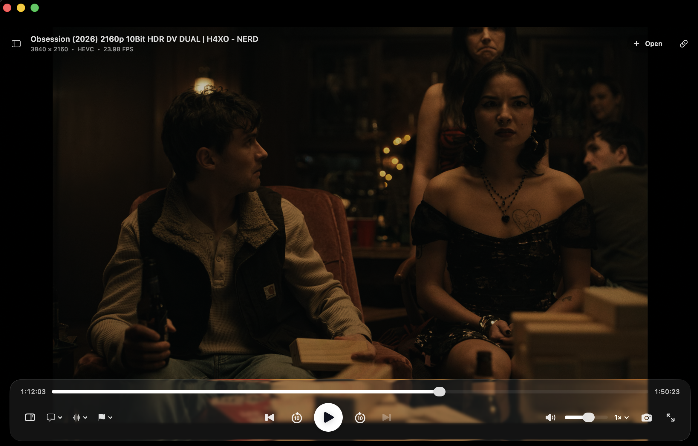

# macmpv

macmpv is a native macOS video player built with SwiftUI. It embeds mpv for
playback and uses ffprobe (from FFmpeg) to read media metadata.



## Features

- Embedded, hardware-accelerated mpv playback
- Local video/audio files and HTTP, HTTPS, RTMP, or RTSP streams
- Drag-and-drop, reorderable queue with next/previous and repeat modes
- Seeking, mute/volume, playback speed, audio tracks, and subtitles
- Per-file playback resume and saved intro/outro markers
- External subtitle loading and selectable audio/subtitle track menus
- PNG screenshots through the player controls or keyboard
- ffprobe metadata for duration, resolution, frame rate, codecs, and format
- Full-screen playback and native macOS keyboard commands

## Requirements

- macOS 26
- Xcode 26 or newer (including Command Line Tools)
- Homebrew `mpv` and `ffmpeg` with `pkg-config`

Verify your toolchain:

```sh
xcode-select -p
swift --version
pkg-config --modversion mpv  # should print 2.x
```

## Quick Start

```sh
brew install mpv ffmpeg pkg-config
make app && open dist/macmpv.app
```

## Install dependencies

```sh
brew install mpv ffmpeg pkg-config
```

If `pkg-config --modversion mpv` fails, ensure Homebrew's pkg-config is on your PATH:

```sh
brew --prefix
export PKG_CONFIG_PATH="$(brew --prefix)/lib/pkgconfig:$PKG_CONFIG_PATH"
```

## Supported Formats

Anything [mpv](https://mpv.io/) / [FFmpeg](https://ffmpeg.org/) can play. Common local extensions:

`mp4`, `m4v`, `mov`, `mkv`, `mka`, `webm`, `avi`, `flv`, `ts`, `mts`, `m2ts`, `mpeg`, `mpg`, `vob`, `wmv`, `asf`, `divx`, `f4v`, `rm`, `rmvb`, `3gp`, `3g2`, `ogv`, `ogm`, `ogg`, `oga`, `opus`, `mp3`, `m4a`, `aac`, `ac3`, `dts`, `flac`, `alac`, `ape`, `aiff`, `caf`, `wav`, `wma` plus `m3u`/`m3u8` playlists.

Network streams: `http`, `https`, `rtmp`, `rtsp`. URL schemes and extension checks are defined in `Sources/Cinewave/MediaModels.swift`.

## Keyboard Shortcuts

| Shortcut | Action |
|----------|--------|
| `⌘ O` | Open media files |
| `Space` | Play / Pause |
| `←` / `→` | Back / Forward 10 seconds |
| `↑` / `↓` | Volume up / down |
| `⌘ ←` / `⌘ →` | Previous / Next item in queue |
| `M` | Mute / Unmute |
| `[` / `]` | Decrease / Increase playback speed |
| `\` | Reset playback speed to 1× |
| `⇧ ⌘ O` | Open external subtitle file |
| `⇧ ⌘ S` | Save screenshot |
| `⌘ ⌥ S` | Show / Hide queue sidebar |
| `Double-click` | Toggle full screen |
| `Click` | Play / Pause (when media loaded) |
| `Esc` | Exit full screen (system) |

Menu commands are defined in `Sources/Cinewave/CinewaveApp.swift`.

## Run from source

```sh
# debug build and run
swift run macmpv
make run   # same as above

# with media
swift run macmpv -- /path/to/video.mp4
```

## Build

| Command | What it does |
|---------|--------------|
| `make build` | `swift build` (debug) |
| `make app` | `swift build -c release` + assembles `dist/macmpv.app` |
| `make clean` | `swift package clean` |

Build the app bundle:

```sh
make app
open dist/macmpv.app
```

The local app bundle links to the Homebrew `libmpv` installation. Keep mpv and
FFmpeg installed while using macmpv.

You can also build directly:

```sh
swift build -c release
zsh Scripts/build-app.sh release
open dist/macmpv.app
```

## Troubleshooting

**`sandbox-exec: sandbox_apply: Operation not permitted`**

You are in a restricted sandbox (Muse sandbox, some CI). Workaround:

```sh
swift build --disable-sandbox
swift build -c release --disable-sandbox
swift build -c release --disable-sandbox --show-bin-path
# or for the app bundle:
swift build -c release --disable-sandbox && zsh Scripts/build-app.sh release
# Scripts/build-app.sh will also use --disable-sandbox automatically if needed
```

Do not use `--disable-sandbox` for normal local builds outside a sandbox.

**`pkg-config` / `mpv` not found**

```sh
brew reinstall mpv pkg-config
pkg-config --modversion mpv
```

**App opens but video is black / no audio**

Ensure `mpv` still installed: `brew list mpv` and `otool -L dist/macmpv.app/Contents/MacOS/macmpv` should show `/opt/homebrew/opt/mpv/lib/libmpv.2.dylib`.

## Architecture

macmpv wraps `libmpv` via `Sources/CMPV` (pkg-config `mpv`) and renders with `MPVEngine` / `MPVGLView` (`Sources/Cinewave/MPVEngine.swift`, `Sources/Cinewave/VideoSurface.swift`). Metadata is probed out-of-process with `ffprobe` (`Sources/Cinewave/MediaProbe.swift`).

Playback uses mpv's copy-back hardware decoding mode. Scrubbing coalesces fast-seek previews (throttled to ~180 ms, `absolute+keyframes`) while dragging the slider, then performs an exact seek on release — see `PlayerModel.previewSeekInterval` and `MPVEngine`.

## Credits

- [mpv](https://mpv.io/) — media playback engine (`libmpv`)
- [FFmpeg](https://ffmpeg.org/) — `ffprobe` for metadata probing (`ffmpeg` Homebrew package)
